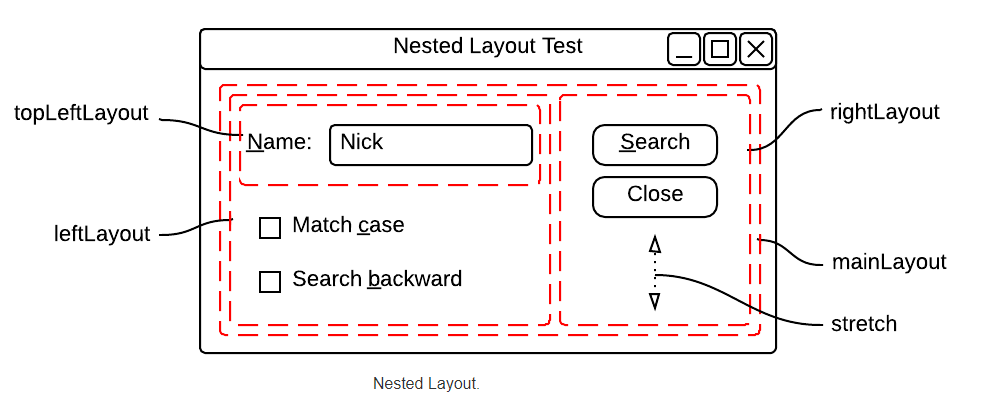
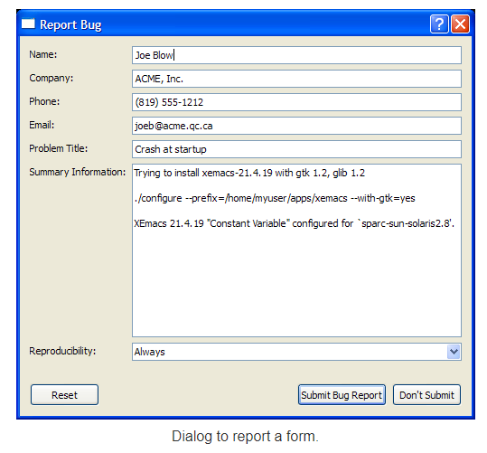

 # Programming Widget Layout
## Layout Management
> The Qt layout system provides a simple and powerful way of automatically arranging child widgets within a widget to ensure that they make good use of the available space.

##   Introduction
+ Qt includes a set of layout management classes that are used to describe how widgets are laid out in an application's user interface. These layouts automatically position and resize widgets when the amount of space available for them changes, ensuring that they are consistently arranged and that the user interface as a whole remains usable.

+ All QWidget subclasses can use layouts to manage their children . The QWidget::setLayout() function applies a layout to a widget. When a layout is set on a widget in this way, it takes charge of the following tasks:

  + Positioning of child widgets
  +   Sensible default sizes for windows
  +  Sensible minimum sizes for windows
  + Resize handling
  + Automatic updates when contents change:
    + Font size, text or other contents of child widgets
    + Hiding or showing a child widget
    + Removal of child widget
## Qt's Layout Classes
 > Qt's layout classes were designed for hand-written C++ code, allowing measurements to be specified in pixels for simplicity, so they are easy to understand and use. The code generated for forms created using Qt Designer also uses the layout classes. Qt Designer is useful to use when experimenting with the design of a form since it avoids the compile, link and run cycle usually involved in user interface development.

 
 


****

##  Sections
 - [Experimenting with QHBOXLayout](#quotes)
- [Nested Layouts](#quotes)
- [Bug report Form](#emphasis)
- [Grid Layout](#horizontal-rule)


## Experimenting with QHBOXLayout
>Create a project called hbox with the following code
```c++
int main(int argc, char* argv[])
{
  QApplication app(argc, argv);

  QWidget* window = new QWidget();
  window->setWindowTitle("QHBoxLayout Test");

  window->show();

  return app.exec();
}
```
This will show an empty window. Your goal is to modify the code in order to display the following form:


****
# **Answer**
## dialog.h
```c++
#include <QWidget>
#include <QLineEdit>
#include <QLabel>
#include <QPushButton>
{
  class dialog : public QWidget
{
public:
    explicit dialog(QWidget*parent=nullptr);
protected:
    void creatWidgets();
    void placeWidgets();

protected:
    QLineEdit*edit;
    QLabel*label;
    QPushButton*search;

};

```
## dialog.cpp
```c++
#include "dialog.h"
#include <QHBoxLayout>
dialog::dialog(QWidget *parent):QWidget(parent)
{
   creatWidgets();
   placeWidgets();

}
    void dialog :: creatWidgets()
    {
        label =new QLabel("name");
        search =new QPushButton("search");
        edit =new QLineEdit;
        this->setWindowTitle("HBoxLayout");
    };
     void dialog :: placeWidgets()
     { auto layout = new QHBoxLayout;
         this->setLayout(layout);
         layout->addWidget(label);
         layout->addWidget(edit);
         layout->addWidget(search);


     };
```
> # Results


*** 
***
# Nested Layouts
+ The goal of the exercice is learn to analyse the construction of a form and thencode it using Netsted layouts.

+ Here we show you a classic dialog from the book GB to search for a user
> You do not have to code any functinality, just the form of the dialog.


+ In order to add a layout to a main one, you’ll have to use
  addLayout(layout)
+ The vertical space (Stretch) could be added by
  + layout->addStretch(dimension)
  + layout->addSpacer(SpaceItem)
+ the Widget with a empty checkable square is a QCheckBox
# **Answer**
## dialog2.h
```c++
#ifndef DIALOG2_H
#define DIALOG2_H
#include <QWidget>
#include <QLineEdit>
#include <QLabel>
#include <QPushButton>
#include <QCheckBox>
class dialog2: public QWidget
{
public:
    explicit dialog2(QWidget*parent=nullptr);
protected:
    void creatWidgets();
    void placeWidgets();
protected:
    QLineEdit*edit;
    QLabel*label;
    QPushButton*search;
    QCheckBox*b1;
    QCheckBox*b2;
    QPushButton*close;
};

#endif // DIALOG2_H
```
## dialog2.ccp
```c++
#include "dialog2.h"
#include <QHBoxLayout>
#include <QCheckBox>
#include <QVBoxLayout>


dialog2::dialog2(QWidget *parent):QWidget(parent)
{creatWidgets();
 placeWidgets();

}
void dialog2 :: creatWidgets()
{
    label =new QLabel("name");
    search =new QPushButton("search");
    close =new QPushButton("close");
    b1 =new QCheckBox("match case");
    b2=new QCheckBox("search backward");
    edit =new QLineEdit;
    this->setWindowTitle("HBoxLayout");
};
void dialog2 :: placeWidgets()
{ auto Mainlayout = new QHBoxLayout;

       auto topleftlayout = new QHBoxLayout;
       topleftlayout->addWidget(label);
       topleftlayout->addWidget(edit);
       auto leftlayout = new QVBoxLayout;

      leftlayout->addLayout(topleftlayout);
      leftlayout->addWidget(b1);
      leftlayout->addWidget(b2);
      auto rightlayout = new QVBoxLayout;
      rightlayout->addWidget(search);
      rightlayout->addWidget(close);
      rightlayout->addStretch(7);
      Mainlayout->addLayout(leftlayout);
      Mainlayout->addLayout(rightlayout);
      this->setLayout(Mainlayout);
};
```
> # Results


*** 
***
# Bug report Form
> This example is taken from Qt Tutorial. You task is to create the following form to report a problem.



# **Answer**
## exo3.h
```c++
#ifndef EXO3_H
#define EXO3_H
#include <QWidget>
#include <QLineEdit>
#include <QTextEdit>
#include <QPushButton>
#include <QComboBox>
#include <QFormLayout>
#include <QLabel>
class exo3 : public QWidget
{
    Q_OBJECT
public:
    explicit exo3(QWidget *parent = nullptr);

protected:

   void createwidgets();
   void placewidgets();
   void connexionwidgets();
   QFormLayout *layout;
   QLineEdit *name;
   QLineEdit *age;
   QLineEdit *email;
   QLineEdit *problem;
   QLineEdit *Phone;
   QLabel *summ;
   QLabel *prod;
   QHBoxLayout *layout2;
   QHBoxLayout *layout3;
   QHBoxLayout *layout4;
   QVBoxLayout *layout5;
   QPushButton *but1;
   QPushButton *but2;
   QPushButton *but3;
QComboBox *combo;
QTextEdit *text;
};
```
## exo3.cpp
```c++
#include "exo3.h"

exo3::exo3(QWidget *parent) : QWidget(parent)
{
createwidgets();
placewidgets();
connexionwidgets();
}
void exo3::createwidgets(){
     but1 = new QPushButton("Reset");
     but2= new QPushButton("Submit Bug report");
     but3 = new QPushButton("Don't SUBMIT");
     summ=new QLabel("Summary :") ;
      prod=new QLabel("Reproducibility :");
     layout2 =new QHBoxLayout ;
      layout3= new QHBoxLayout;
      layout4= new QHBoxLayout;
      layout5=new QVBoxLayout;
  combo = new QComboBox();
  text = new QTextEdit;
  layout= new QFormLayout;
  name =new QLineEdit;
  age =new QLineEdit;
  email=new QLineEdit;
  problem=new QLineEdit;
  Phone=new QLineEdit;
 setLayout(layout5);  }

void exo3::placewidgets(){
    combo->addItem(tr("Always"));
    combo->addItem(tr("Sometimes"));
    combo->addItem(tr("Rarely"));
    layout->setAlignment(Qt::AlignRight | Qt::AlignHCenter);
    layout->addRow("name: ", name);
    layout->addRow("Company :", age);
    layout->addRow("Phone :", Phone);
    layout->addRow("email :",email );
    layout->addRow("Problem Title :", problem);
    layout2->addSpacerItem(new QSpacerItem(14,20));
    layout2->addWidget(summ);
    layout2->addWidget(text);
    layout5->addLayout(layout);
    layout5->addLayout(layout2);
    layout5->addLayout(layout3);
    layout5->addLayout(layout4);
    layout3->addWidget(prod);
    layout3->addWidget(combo);
    layout4->addWidget(but1);
     layout4->addWidget(but2);
      layout4->addWidget(but3);
}
void exo3::connexionwidgets(){}
```

> # Results


*** 
***
# Grid Layout
> For our final exercice, we will visit an imporant layout that we missed in class.

+ Check and read the documentation for the QGridLayout

+ Once you’ve read it, try to construct the following calculator:

<br>


# **Answer**
## dialog4.h
```c++
#ifndef DIALOG4_H
#define DIALOG4_H
#include <QWidget>
#include<QVBoxLayout>
#include<QPushButton>
#include<QGridLayout>
#include<QLCDNumber>

class dialog4 : public QWidget
{
public:
    explicit dialog4 (QWidget*parent=nullptr);
protected:
    void createwidgets();
    void placewidgets();
QPushButton *b1;
QPushButton *b2;
QPushButton *b3;
QPushButton *b4;
QPushButton *b5;
QPushButton *b6;
QPushButton *b7;
QPushButton *b9;
QPushButton *b8;
QPushButton *b10;
QPushButton *b11;
QGridLayout *grid;
//QWidget *window;
QLCDNumber *number;
QVBoxLayout *layout;
};

#endif // DIALOG4_H

```

## dialog4.cpp
```c++
#include "dialog4.h"
#include<QPushButton>
#include<QLineEdit>
#include<QCheckBox>
#include<QHBoxLayout>
#include<QLabel>
#include<QApplication>
#include <QVBoxLayout>
#include<QLayout>
#include<QLCDNumber>
dialog4::dialog4(QWidget *parent):QWidget(parent)
{createwidgets();
    placewidgets();
}
void dialog4 :: createwidgets()
{b1=new QPushButton("7");
    b2=new QPushButton("8");
    b3=new QPushButton("9");
    b4=new QPushButton("4");
    b5=new QPushButton("5");
    b6=new QPushButton("6");
    b7=new QPushButton("1");
    b8=new QPushButton("2");
    b9=new QPushButton("3");
    b10=new QPushButton("0");
    b11=new QPushButton("enter");

}
void dialog4 :: placewidgets()
{auto layout=new QGridLayout;
    auto cd=new QLCDNumber;
    cd->setMinimumHeight(80);
    layout->addWidget(cd,0,0,1,3);
    setLayout(layout);
    layout->addWidget(b1,1,0);
    layout->addWidget(b2,1,1);
    layout->addWidget(b3,1,2);
    layout->addWidget(b4,2,0);
    layout->addWidget(b5,2,1);
    layout->addWidget(b6,2,2);
    layout->addWidget(b7,3,0);
    layout->addWidget(b8,3,1);
    layout->addWidget(b9,3,2);
    layout->addWidget(b10,4,0);
    layout->addWidget(b11,4,1,1,2);
}
```
## main.cpp
```c++
#include <QApplication>
#include "dialog.h"
#include "dialog2.h"
#include "exo3.h"
#include "dialog4.h"

int main(int argc, char* argv[])
{
  QApplication app(argc, argv);
  dialog4 *dialog1 =new dialog4();
  dialog1->show();
;
  return app.exec();
}

```
> # Results


## Additional Resources
- https://anassbelcaid.github.io/CS311/
- https://doc.qt.io/qt-5/layout.html

